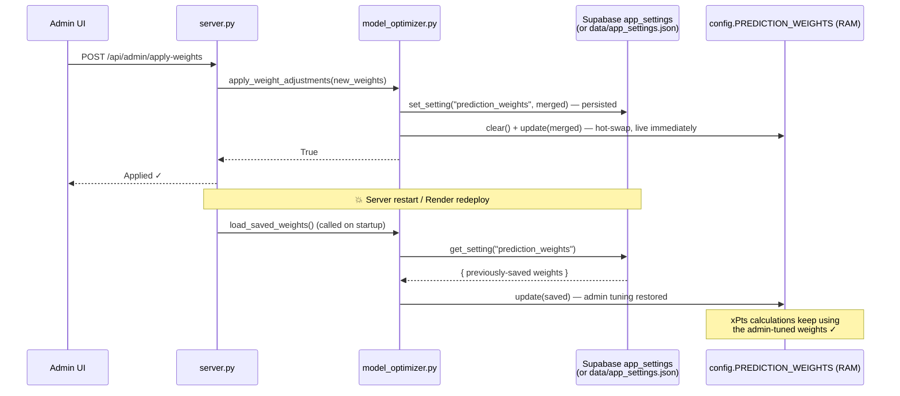

# ⚽ FPL Predictor — AI-Powered Fantasy Premier League Optimizer

An intelligent prediction and squad optimization system for Fantasy Premier League. Features a **13-factor Poisson model**, real-time injury news, interactive **transfer simulator**, season-wide **chip planner**, **AI chat**, and a modern glassmorphism UI with light/dark theme.

**Live**: [fpl-predictor-e0zz.onrender.com](https://fpl-predictor-e0zz.onrender.com) — deployed on Render free tier.

---

## ✨ Key Features

| Feature | Description |
|---------|-------------|
| 🧠 **13-Factor Prediction Model** | Poisson-based xPts: form, FDR, team strength, xG, win probability, ICT, injuries |
| 🎲 **Win Probability** | Per-fixture match outcome model using independent Poisson distributions |
| 🏥 **Injury Intelligence** | Real-time news from Fabrizio Romano, David Ornstein, Ben Dinnery — overrides slow FPL updates |
| ⚡ **Transfer Simulator** | FPL-style pitch, click-to-sell, double-click-to-buy, drag-to-swap, Optimize XI |
| 🎯 **Season Chip Planner** | Scans all remaining GWs, scores each chip 0-100, uses your actual squad |
| 📅 **GW Planner** | Multi-GW transfer planning with rolling budget and FT simulation |
| 📊 **Fixture Ticker** | All 20 teams × 5-15 GW horizon, FDR colors, DGW/BGW indicators (**free for all**) |
| 🔥 **Top Transfers** | Most transferred in/out players, price risers/fallers, net movers |
| 🤖 **AI Chat** | 12 intents, what-if scenarios, per-fixture breakdown — no external LLM needed |
| 👤 **User Tiers** | Free / Premium ($2.50/mo) / Admin — with Stripe payment integration |
| 🔬 **Model Optimizer** | Analyze accuracy, auto-suggest weights, one-click apply + hot reload (Admin) |
| 🎨 **Modern UI** | Glassmorphism, vibrant gradients, light/dark theme toggle |

---

## 🚀 Quick Start

```bash
# Install dependencies
pip install -r requirements.txt

# Start the dashboard (auto-generates predictions on first load)
python server.py         # → http://localhost:8888
```

The server fetches all data from the official FPL API and auto-refreshes every 2 hours.

---

## 🏗️ System Architecture

End-to-end view of every moving part in production — browser, Flask server,
prediction / optimization engines, admin tooling, and the external services
the app talks to.

```mermaid
flowchart LR
    %% ========== CLIENTS ==========
    subgraph Client["🌐 Client (Browser)"]
        UI["dashboard.html<br/>Single-file SPA<br/>Light/Dark theme"]
        LOGIN["Login / Register<br/>+ Google OAuth<br/>+ Forgot password"]
    end

    %% ========== EDGE ==========
    subgraph Edge["🚪 Edge (Render.com)"]
        GUNI["Gunicorn<br/>1 worker · 4 threads"]
        RL["flask-limiter<br/>login 10/min · chat 20/min<br/>heavy 3–5/min"]
        CACHE["In-memory TTL cache<br/>fixture-ticker 2m · top-transfers 5m"]
    end

    %% ========== APP ==========
    subgraph App["🧠 Flask App (server.py)"]
        AUTH["auth.py<br/>PBKDF2-SHA256<br/>session tokens (30d)<br/>tiers: free / premium / admin"]
        ROUTES["REST API<br/>/api/predictions · /api/my-team<br/>/api/chat · /api/fixture-ticker<br/>/api/admin/* · /api/health"]
        CHAT["ai_chat.py<br/>12 intents NLU"]
        ANALYST["ai_analyst.py<br/>team + player insights"]
    end

    %% ========== DOMAIN ENGINES ==========
    subgraph Engines["⚙️ Domain Engines"]
        PRED["prediction_engine.py<br/>13-factor Poisson xPts"]
        SQUAD["squad_optimizer.py<br/>beam + local search"]
        GW["gw_planner.py<br/>multi-GW planner"]
        CHIP["chip_planner.py<br/>season chip optimizer"]
        TEAM["team_analysis.py<br/>win prob · fixture xG"]
        MYTEAM["my_team.py<br/>FPL team import"]
    end

    %% ========== ADMIN ==========
    subgraph Admin["🛡️ Admin Tooling"]
        MOPT["model_optimizer.py<br/>backtest · suggest weights<br/>persisted to storage"]
        RULES["fpl_rules.py<br/>rule reviewer<br/>auto-refine calc"]
        EMAIL["email_service.py<br/>verify · reset"]
    end

    %% ========== DATA ==========
    subgraph Data["💾 Data Layer"]
        SUPA[("Supabase Postgres<br/>users · sessions · settings<br/>model_weights")]
        JSON["Local JSON<br/>data/ · cache/ · output/<br/>(atomic writes, RLock)"]
        CONF["config.py<br/>weights · thresholds"]
    end

    %% ========== EXTERNAL ==========
    subgraph Ext["🌍 External Services"]
        FPL[("FPL Official API<br/>fantasy.premierleague.com")]
        NEWS["news_aggregator.py<br/>multi-source RSS/HTML"]
        GOOG[("Google OAuth")]
        SMTP[("SMTP provider<br/>transactional mail")]
    end

    %% ========== EDGES ==========
    UI -->|HTTPS| GUNI
    LOGIN -->|HTTPS| GUNI
    LOGIN -. OAuth .-> GOOG
    GOOG -. callback .-> AUTH

    GUNI --> RL --> CACHE --> ROUTES
    ROUTES --> AUTH
    ROUTES --> CHAT
    ROUTES --> ANALYST
    ROUTES --> PRED
    ROUTES --> SQUAD
    ROUTES --> GW
    ROUTES --> CHIP
    ROUTES --> TEAM
    ROUTES --> MYTEAM
    ROUTES --> MOPT
    ROUTES --> RULES

    AUTH <--> SUPA
    AUTH --> EMAIL --> SMTP

    PRED --> CONF
    SQUAD --> PRED
    GW --> PRED
    CHIP --> PRED
    TEAM --> PRED
    MYTEAM --> FPL
    PRED --> FPL
    NEWS --> ROUTES

    MOPT -->|writes weights| SUPA
    MOPT -. reads history .-> JSON
    RULES -->|confirmed changes| CONF
    CONF <-. hot-reload .- PRED

    classDef ext fill:#fff2cc,stroke:#d6b656,color:#222
    classDef data fill:#e1f5fe,stroke:#0288d1,color:#222
    classDef admin fill:#fde2e2,stroke:#d32f2f,color:#222
    class FPL,GOOG,SMTP,NEWS ext
    class SUPA,JSON,CONF data
    class MOPT,RULES,EMAIL admin
```

### Request lifecycle (happy path)

```
Browser ─► Gunicorn ─► flask-limiter ─► TTL cache ─► Flask route
                                                             │
                                             ┌───────────────┼─────────────────┐
                                             ▼               ▼                 ▼
                                        auth.py        prediction_engine   squad/gw/chip
                                        (Supabase)     (+ config weights)  optimizers
                                             │               │                 │
                                             └───► JSON response ◄───────────────┘
```

### Deployment topology

| Layer           | Where it runs                | Persistence                                   |
|-----------------|------------------------------|-----------------------------------------------|
| Static SPA      | Served by Flask from repo    | Stateless                                     |
| Flask + engines | Render.com (Gunicorn)        | Ephemeral FS + `cache/`, `output/`, `data/`   |
| Primary DB      | Supabase (Postgres)          | Users, sessions, settings, tuned weights      |
| FPL data        | Local disk cache (`cache/`)  | Rehydrated from FPL API on cold start         |
| Secrets         | Render env vars              | `SUPABASE_*`, `GOOGLE_OAUTH_*`, `SMTP_*`      |

### Admin write paths (the ones that *mutate* the model)

- **Model Optimization → Apply** → `model_optimizer.py` writes new weights into
  Supabase (`model_weights`) and hot-reloads `config.py` in-process, so
  `prediction_engine` picks them up immediately — survives server restarts.
- **FPL Rule Reviewer → Confirm** → `fpl_rules.py` diffs the official rules
  snapshot, shows the delta in the admin UI, and on confirmation patches the
  scoring constants in `config.py` so future xPts calculations use the new rules.

---

## 📁 Project Structure

```
fpl-predictor/
├── server.py              # Flask web server (v9) — REST API, rate limiting, caching
├── dashboard.html         # Single-file SPA (~210KB) — full interactive dashboard
├── auth.py                # User auth + subscription tiers (free/premium/admin)
├── prediction_engine.py   # 13-factor Poisson prediction model
├── squad_optimizer.py     # Beam search + local search optimizer
├── gw_planner.py          # Multi-GW planner + fixture ticker
├── chip_planner.py        # Season-wide chip deployment optimizer
├── ai_chat.py             # Semantic NLU chat engine (12 intents)
├── my_team.py             # FPL team import via Team ID
├── team_analysis.py       # Team-level stats, win probability, fixture xG
├── data_fetcher.py        # FPL API client with local caching
├── news_aggregator.py     # Multi-source news aggregation
├── model_optimizer.py     # Prediction accuracy analysis + weight tuning
├── config.py              # All weights, thresholds, scoring rules
├── requirements.txt       # Python dependencies
├── render.yaml            # Render.com deployment config
├── Procfile               # Gunicorn process config
├── SETUP.md               # Full setup & payment integration guide
├── SCALABILITY.md         # Architecture & growth roadmap
└── data/                  # User accounts & sessions (auto-created, gitignored)
```

---

## 👤 User Tiers

| Feature | Free | Premium ($2.50/mo) | Admin |
|---------|------|---------------------|-------|
| Import FPL Team | ✅ | ✅ | ✅ |
| Fixture Ticker (all teams) | ✅ | ✅ | ✅ |
| Top Transfers | ✅ | ✅ | ✅ |
| Light/Dark Theme | ✅ | ✅ | ✅ |
| AI Chat | 3/day | Unlimited | Unlimited |
| xPts Predictions | 🔒 | ✅ | ✅ |
| Win Probability | 🔒 | ✅ | ✅ |
| Transfer Simulator | 🔒 | ✅ | ✅ |
| Chip Strategy | 🔒 | ✅ | ✅ |
| GW Planner | 🔒 | ✅ | ✅ |
| User Management | ❌ | ❌ | ✅ |
| Model Optimization | ❌ | ❌ | ✅ |

---

## 🧠 Prediction Model

13-factor Poisson model with configurable weights:

| Factor | Weight | Description |
|--------|--------|-------------|
| Form | 20% | 65% short-term (last 5 GW) + 35% season average |
| Fixture Difficulty | 15% | Position-aware: attackers dampened, defenders amplified |
| Team Form | 10% | Last-5 win rate + goals + momentum |
| ICT Index | 10% | FPL's Influence, Creativity, Threat |
| Season Average | 8% | Points per game, normalized |
| H2H Factor | 8% | Head-to-head record + fixture-specific xG |
| Win Probability | 8% | Poisson-based team win probability |
| Home/Away | 7% | +12% home, -10% away |
| Minutes Consistency | 7% | With volatility penalty |
| Team Strength | 5% | FPL team ratings |
| Set Pieces | 5% | Penalty/corner/FK duties |
| Transfer Momentum | 3% | Community transfer trends |
| Bonus Tendency | 2% | Historical bonus persistence |

### Key Techniques
- **Poisson goal model**: Multi-goal expected value, not linear
- **Poisson CS probability**: `P(CS) = e^(-opponent_xG)` blended with FDR
- **Win probability**: Independent Poisson distributions, clamped [5%, 95%]
- **Realistic injury penalty**: 75% chance → 0.92x, 50% → 0.55x, 25% → 0.22x
- **DGW starter tiers**: Nailed=88%, Regular=60%, Rotation=25%, Fringe=8%
- **Teammate injury boost**: Same-position teammate out → tier promotion

---

## ⚙️ Server Architecture (v9)

| Feature | Details |
|---------|---------|
| **Framework** | Flask + Gunicorn (1 worker, 4 threads) |
| **Rate Limiting** | flask-limiter — login 10/min, chat 20/min, heavy endpoints 3-5/min |
| **Response Caching** | In-memory TTL cache for fixture-ticker (2min), top-transfers (5min) |
| **HTTP Cache Headers** | Static assets: 1 day; HTML: 5 min; API: no-cache |
| **Thread Safety** | RLock on all JSON file I/O, atomic writes via tmp→rename |
| **CORS** | Full preflight (OPTIONS) handling for cross-browser compatibility |
| **Auth** | Session tokens (30-day TTL), PBKDF2-SHA256 password hashing |
| **Health Check** | `GET /api/health` — status, cache stats, prediction availability |

---

## 📡 API Reference

### Public Endpoints
| Endpoint | Method | Description |
|----------|--------|-------------|
| `/api/fixture-ticker?horizon=5` | GET | All 20 teams' fixtures (free) |
| `/api/fixture-rankings?gws=5` | GET | Teams ranked by FDR (free) |
| `/api/top-transfers` | GET | Top transfers in/out this GW (free) |
| `/api/health` | GET | Server health check |

### Auth Endpoints
| Endpoint | Method | Description |
|----------|--------|-------------|
| `/api/auth/register` | POST | Create account (honours `REQUIRE_EMAIL_VERIFICATION`) |
| `/api/auth/login` | POST | Get session token |
| `/api/auth/me` | POST | Validate token |
| `/api/auth/forgot-password` | POST | Send a password-reset email |
| `/api/auth/reset-password` | POST | Set a new password with a reset token |
| `/api/auth/verify-email` | POST | Mark an account verified with a token |
| `/api/auth/resend-verification` | POST | Resend the verification email |
| `/api/auth/google/login` | GET | Start Google OAuth flow (if enabled) |
| `/api/auth/google/callback` | GET | OAuth return landing |
| `/api/auth/google/exchange` | POST | Swap Supabase access_token for a session |
| `/api/stripe/create-checkout` | POST | Start Stripe checkout |
| `/api/stripe/webhook` | POST | Stripe webhook |

### Data Endpoints (require auth)
| Endpoint | Method | Description |
|----------|--------|-------------|
| `/api/predictions` | GET | All player predictions |
| `/api/my-team?id=12345` | GET | Fetch & enrich FPL team |
| `/api/search-players?q=haaland` | GET | Search players |
| `/api/simulate-transfer` | POST | Transfer impact analysis |
| `/api/gw-planner?id=12345&horizon=5` | GET | Multi-GW transfer plan |
| `/api/season-chips` | GET | Season chip analysis |
| `/api/chip-analysis` | GET | Current GW chip scoring |
| `/api/chat` | POST | AI chat |

### Admin Endpoints
| Endpoint | Method | Description |
|----------|--------|-------------|
| `/api/admin/users` | POST | List all users |
| `/api/admin/set-plan` | POST | Change user plan |
| `/api/admin/delete-user` | POST | Delete user |
| `/api/admin/model-analysis` | GET | Accuracy metrics |
| `/api/admin/apply-weights` | POST | Apply new weights + regen |
| `/api/run` | GET | Trigger prediction run (admin only) |
| `/api/refresh` | GET | Trigger data refresh (admin only) |

---

## 🔐 Authentication Setup

The app ships with a light-weight auth layer ("A1-lite"): PBKDF2 password hashing,
Supabase-backed user storage, optional email verification, password reset, and an
opt-in Google sign-in button. No heavyweight identity provider required.

### Required env vars (already set for Supabase storage)
| Key | Description |
|-----|-------------|
| `SUPABASE_URL` | Your Supabase project URL |
| `SUPABASE_KEY` | Service role secret key (server-side only) |

### Optional email features (Gmail SMTP or Resend)

Used for "Forgot password" and "Verify email" links. Without either backend
configured, the app still runs — the reset/verify links are printed to the
server log instead of emailed (dev-mode).

Two backends are supported and auto-selected in this order:

1. **Generic SMTP** — *recommended for personal / small deployments*. Works with
   any Gmail account via a 16-character [App Password](https://myaccount.google.com/apppasswords).
   No custom domain required; delivers to **any** recipient. Free, ~500/day.
2. **Resend** — better deliverability once you own a domain you can verify.
   Sandbox (`onboarding@resend.dev`) only delivers to the Resend account owner.

| Key | Backend | Description |
|-----|---------|-------------|
| `SMTP_HOST` | SMTP | `smtp.gmail.com` for Gmail |
| `SMTP_PORT` | SMTP | `587` (STARTTLS, default) or `465` (implicit TLS) |
| `SMTP_USER` | SMTP | Your Gmail address, e.g. `you@gmail.com` |
| `SMTP_PASS` | SMTP | 16-char [Google App Password](https://myaccount.google.com/apppasswords) (requires 2FA on the account). **Not** your Google login password. |
| `SMTP_USE_SSL` | SMTP | optional, `1` to force implicit TLS (port 465). Default: autodetect. |
| `RESEND_API_KEY` | Resend | Get one free at [resend.com](https://resend.com) (3000 emails/month) |
| `EMAIL_FROM` | common | From address, e.g. `FPL Predictor <you@gmail.com>`. For Gmail SMTP this **must** match `SMTP_USER` or Gmail will rewrite it. |
| `PUBLIC_BASE_URL` | common | Public site URL, e.g. `https://fpl-predictor-e0zz.onrender.com` (falls back to `RENDER_EXTERNAL_URL` which Render injects automatically). Links in emails use this. |
| `REQUIRE_EMAIL_VERIFICATION` | common | `true` to force new signups to verify before first login. Default `false` (existing users unaffected). |

**Minimum Gmail setup on Render** (fastest path to working emails):

```
SMTP_HOST=smtp.gmail.com
SMTP_PORT=587
SMTP_USER=your-gmail@gmail.com
SMTP_PASS=abcd efgh ijkl mnop        # 16-char app password, spaces optional
EMAIL_FROM=FPL Predictor <your-gmail@gmail.com>
PUBLIC_BASE_URL=https://fpl-predictor-e0zz.onrender.com
REQUIRE_EMAIL_VERIFICATION=true
```

After saving those env vars on Render, trigger a redeploy. New signups will
need to click a verify link in their inbox; Forgot-password will send real
reset emails.

### Persistent app settings (admin-tuned weights, team_id, etc.)

The app keeps a small generic key-value store in Supabase so things like
**admin-tuned model weights** and the **FPL team ID** survive container restarts
on Render (whose filesystem is ephemeral).

Create this table once, in Supabase *SQL editor*:

```sql
create table if not exists app_settings (
    key         text primary key,
    value       jsonb not null,
    updated_at  timestamptz default now()
);
-- Service role bypasses RLS, so no policies required for server-side writes.
```

What gets stored:

| Key | Source | Purpose |
|-----|--------|---------|
| `prediction_weights` | Admin → Model Analysis → *Apply weights* | Hot-swapped in memory AND reloaded at startup — predictions survive restart |
| `user_settings` | Admin → *Import team ID* | Replaces the old `user_settings.json` local file |

If `SUPABASE_URL` / `SUPABASE_KEY` are **not** set, the store automatically
falls back to `data/app_settings.json` — fine for local dev, but lost on Render
redeploys (same caveat as the old file).

<!-- _PERSIST_README_PATCH_ -->

#### What happens when an admin clicks *Apply* in Model Optimization



Key guarantees:

- **Persistence** — weights land in `app_settings` (or the JSON fallback) *before*
  the API responds. No "eventually consistent" gap.
- **Hot-swap** — `PREDICTION_WEIGHTS` is mutated in place, so every module that
  `from config import PREDICTION_WEIGHTS` sees the new values without a restart.
- **Restart recovery** — `server.py` calls `load_saved_weights()` during startup;
  saved admin weights override the defaults baked into [`config.py`](config.py).
- **Reset path** — `POST /api/admin/reset-weights` deletes the setting and
  reverts RAM back to the `config.py` defaults.

#### Gmail SMTP setup (recommended — 5 minutes)

Send from your own Gmail to **any** recipient with no domain or sandbox
restrictions.

1. Enable 2-step verification on your Google account (required for app passwords).
2. Visit [myaccount.google.com/apppasswords](https://myaccount.google.com/apppasswords),
   create an app password called "FPL Predictor", copy the 16-character value.
3. On Render → **Environment** → add:
   - `SMTP_HOST` = `smtp.gmail.com`
   - `SMTP_PORT` = `587`
   - `SMTP_USER` = your Gmail address
   - `SMTP_PASS` = the 16-char app password
   - `EMAIL_FROM` = `FPL Predictor <your-gmail@gmail.com>`
   - `PUBLIC_BASE_URL` = your Render URL (no trailing slash)
   - `REQUIRE_EMAIL_VERIFICATION` = `true` (optional but recommended)
4. Save → auto-redeploy. New signups will receive a verification email; the
   "Forgot password" link will send a real reset email.

> **Troubleshooting** — a Gmail `SMTPAuthenticationError` in the server log
> almost always means the password is a login password instead of a 16-char app
> password, or 2-step verification isn't enabled on the sending account.

#### Resend setup (alternative — for bulk / custom-domain senders)
1. Sign up at [resend.com](https://resend.com) — no credit card needed.
2. Dashboard → **API Keys** → **Create API Key** → copy `re_xxx...`.
3. (Optional) **Domains** → add and verify your domain so you can send from
   `noreply@yourdomain.com`. Until you verify a domain, Resend only delivers to
   *your own* account email (sandbox mode) — perfectly fine for testing.
4. On Render → **Environment** → add `RESEND_API_KEY` (and optionally `EMAIL_FROM`,
   `PUBLIC_BASE_URL`). Save → auto-redeploy.

### Google Sign-In (optional, opt-in)

Powered by Supabase's built-in Google OAuth provider — no Google client libraries
needed in the app itself. Steps:

1. **Google Cloud Console**
   - Create a project (or reuse one).
   - *APIs & Services → OAuth consent screen* → fill in the basics (external, test
     users = your email while unpublished).
   - *Credentials → Create Credentials → OAuth Client ID* → **Web application**.
   - **Authorised redirect URIs** — add exactly this (Supabase handles Google's
     side of the redirect):
     ```
     https://<your-project-ref>.supabase.co/auth/v1/callback
     ```
   - Save and copy the **Client ID** and **Client Secret**.

2. **Supabase Dashboard**
   - *Authentication → Providers → Google* → toggle **Enabled**.
   - Paste the **Client ID** and **Client Secret** from step 1.
   - Under *Authentication → URL Configuration*, add your site URL
     (`https://fpl-predictor-e0zz.onrender.com`) to **Site URL** and to
     **Additional Redirect URLs** add:
     ```
     https://fpl-predictor-e0zz.onrender.com/api/auth/google/callback
     ```
   - Save.

3. **Render env vars**
   - `GOOGLE_OAUTH_ENABLED` = `true`
   - (No client ID/secret needed on our side — Supabase handles the exchange.)
   - Save → auto-redeploy.

4. **Show the button on the frontend**
   - The "Sign in with Google" button is already rendered but hidden by default
     (`display:none`). To reveal it, either:
     - Edit `dashboard.html` and change `id="auth-google-btn"` style to
       `display:block`, **or**
     - Add a tiny feature-flag endpoint to your server and toggle the button
       from JS based on its response. (Left as a one-line follow-up.)

5. **How the flow works** (just so you know what's happening):
   ```
   User clicks "Sign in with Google"
        │
        ▼
   GET /api/auth/google/login
        │  (redirects to)
        ▼
   https://<ref>.supabase.co/auth/v1/authorize?provider=google&redirect_to=…
        │  (Supabase → Google → Supabase)
        ▼
   GET /api/auth/google/callback  (our page, parses #access_token from URL)
        │  (JS posts token to)
        ▼
   POST /api/auth/google/exchange
        │  (server calls Supabase /auth/v1/user to verify, then upsert_oauth_user)
        ▼
   Returns our own session token → user is logged in.
   ```

<!-- _ALITE_README_PATCH_ -->

---

## 🚀 Deployment

See **[SETUP.md](SETUP.md)** for full deployment guide including:
- Render.com deployment (free tier)
- Environment variables
- Stripe payment gateway setup
- Account configuration
- Troubleshooting

### Quick Deploy to Render
1. Fork/push to GitHub
2. Create Render Web Service → connect repo → root dir: `fpl-predictor`
3. Add env vars: `ADMIN_EMAIL`, `ADMIN_PASSWORD`
4. Deploy — accounts auto-created on first request

---

## 📄 License

Personal use. FPL data belongs to the Premier League.


---

## 🛠️ Recent Fixes

### Admin / Premium gating — cache poisoning (fixed)

**Symptom:** Users on the `admin` (or `premium`) tier were still seeing
`🔒 Unlock` / `Upgrade to see` placeholders on the Overview, Best Squad,
Captain pick, Best Chip, xPts columns, etc. — even though the sidebar
correctly showed their `ADMIN` badge.

**Root cause:** `/api/predictions` locked premium fields on free/guest
requests by **mutating** the dictionaries returned by
`_cached_predictions()`. Those dictionaries are the process-wide memo
cache (keyed by file mtime), so a single free/guest request would rewrite
`predicted_points`, `squad.captain`, `chip_analysis.best_chip`, etc. to
`"🔒"` in the shared cache. Every subsequent request — including admin and
premium — then received the already-locked data until the predictions file
was regenerated.

**Fix:** In `server.py::api_predictions`, deep-copy `data` and `preds`
before applying any lock mutations for free/guest users. The shared cache
is now read-only from the route's perspective, so admin/premium users
always receive the full, unlocked payload. See `server.py` around the
`if not is_premium:` branch.

---

## FPL Rule Reviewer (admin)

The admin dashboard (`/#admin`) includes a **FPL Rule Reviewer** card that
keeps the app in sync with the official game when Premier League changes
structural rules each season (for example: "no more 2 Free Hits", "budget
raised to £100.5m", or new chips like the 2025/26 Manager chip).

**How it works**

1. Click **Review FPL Rules** — the backend fetches the live
   `/api/bootstrap-static/` JSON from `fantasy.premierleague.com`, extracts the
   structural rules (squad size, budget, per-position limits, transfer cost,
   captain multiplier, chip counts) and diffs them against the stored
   baseline.
2. Each changed rule is shown with a checkbox:
   - **SAFE** rows are structural JSON rules we can validate programmatically —
     pre-checked, ready to apply.
   - **REVIEW** rows (scoring point values) are never auto-applied. Those
     numbers live only on the official rules HTML page; the admin must
     update `config.SCORING` manually.
3. Click **Apply Selected** — the backend re-fetches live, refuses any rule
   whose value no longer matches the admin's snapshot (stale/tampered
   protection), writes accepted values to `app_settings.fpl_rules_overrides`
   in Supabase, and hot-swaps them into `config` in memory. Predictions
   regenerate in the background.
4. **Rollback** clears every override. Next process start uses `config.py`
   defaults; next Review captures a fresh baseline.

**Persistence**

All three artefacts live under your Supabase `app_settings` table
(the same one used for admin-tuned model weights):

| Key | Purpose |
|---|---|
| `fpl_rules_baseline` | last-accepted rule snapshot |
| `fpl_rules_overrides` | applied values, re-played onto `config` on startup |
| `fpl_rules_history` | audit log (last 20 apply/rollback events) |

No table changes needed if you already ran the `app_settings` SQL from the
"Supabase setup" section above.
